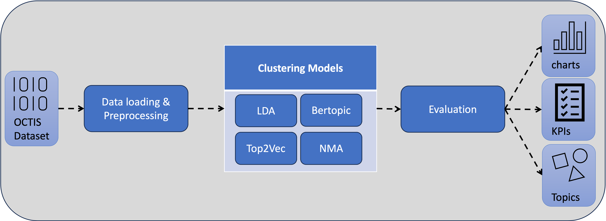

# Chat Message Clustering

With the help of the framework it is possible to measure how accurately previously defined categories on a set of chat messages can be reproduced by algorithms from the field of topic modelling.
The framework is based on the [OCTIS Library](https://github.com/MIND-Lab/OCTIS) library and extends it with useful features in the context of the current use case. 
This code was developed as part of a thesis for the Applied Computer Science degree programme. 

## Structure
In the first step, a dataset is loaded from an excel file and preprocessed in different steps depending on the model. Then, different models from the field of topic modelling are used to create groupings for the data. This grouping is evaluated with different metrics in the third step.

### Input
An Excel file is loaded via the preprocessing class, which has the columns 'Message' and 'Topic'. The first column contains the messages in their original formatting. In the Topic column, topics are assigned to the messages; each message is assigned to a topic. The topics are represented by a keyword (e.g. 'car' or 'consumption').

### Output
The output of a successfully completed test is three files:
- An overview of the documents with the topics found (excel file).
- A table with the most important words per topic and the number of messages in the corresponding topic (excel file)
- An overview of the hyperparameters, as well as KPIs for evaluating the result (csv file)

In addition, illustrations can be generated for the Bertopic and Top2Vec algorithms to show the results.

### Models
In addition to the models from the OCTIS library (LDA and NMF), two further models were created for [Bertopic](https://github.com/MaartenGr/BERTopic) and [Top2Vec](https://github.com/ddangelov/Top2Vec). These are located in the `models/` directory.

